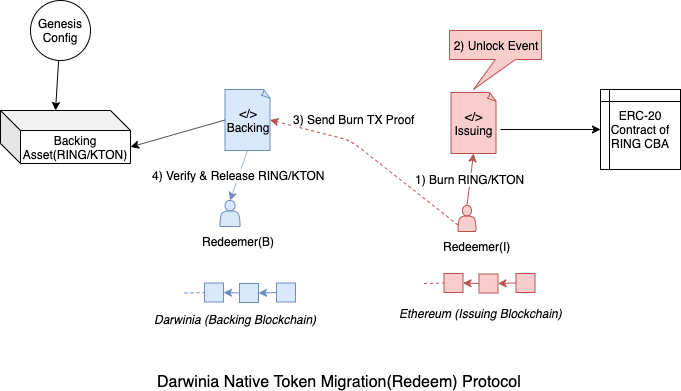

# Darwinia Token Migration By Cross-chain Redeem Protocol

## I. 概述

在Darwinia主网上线之前，已经有一部分RING/KTON资产以ERC20或TRC20的形式存在于以太坊网络或者波场网络之中。从资产跨链的角度来看，因为RING和KTON是被定义成Darwinia 网络的原生资产，因此这些ERC20 Token本质上是以某种形式跨链到以太坊网络上的，也可以理解为CBA (Cryptocurreny Backed Assets)，也就是说，每个ERC-20 RING都有相应的RING被锁定在Darwinia 主网上面，在主网上线之前，相应的背书资产即存在于创世块(Genesis)中。

RING和KTON的ERC20 Token信息:

- RING Token Address: https://etherscan.io/token/0x9469d013805bffb7d3debe5e7839237e535ec483
- KTON Token Address: https://etherscan.io/token/0x9f284e1337a815fe77d2ff4ae46544645b20c5ff

本文将在[RFC-0012: Darwinia Bridge Core: Interoperation in ChainRelay Enabled Blockchains](./0012-darwinia-bridge-core-interoperation-in-chainrelay-enabled-blockchains.md)的基础上，讨论Darwinia主网上线后，ERC-20形式的RING如何赎回至Darwinia网络，以及如何借助于Darwinia 转接桥的设计，Token将如何在Darwinia主网及其他公链中进行流转。


## II. 方案

### A. 设计范围

- Darwinia原生资产RING/KTON跨链设计。主要描述如何应用ERC-0012及相关跨链互操作协议，帮助RING/KTON实现在Darwinia网络和其他支持智能合约的网络(例如，以太坊、TRON、EOS)之间流转
- 创世块中管理背书资产。当Darwinia主网上线时，目前以ERC20/TRC20形式存在的RING/KTON对应的原生资产将会记录在创世块之中，并被背书管理模块锁定，用于支持后续外部资产的赎回。
- 背书管理模块的其他主要功能。背书管理模块还将满足主网上线后其他的跨链转账需求，例如后续用户如何将主网上的RING/KTON原生资产跨链到以太坊上。其发行出来的ERC20代币(代表CBA)将与现有的RING/KTON合约共享同一个ERC-20智能合约。
- 外部链的发行合约和chain relay。这部分方案的可行性依赖于chain relay的实现方案，主要是如何在以太坊上实现一个低成本可持续运行的Darwinia Chain Relay，这部分的细节不在此处描述，具体可参考 RFV-0012 VI章节。在以太坊实现了一个Darwinia Chain Relay的基础之上，外部链需要新增一个发型管理合约(Issuing Contract)用于接受Darwinia上的跨链转账交易证明，并通过Darwinia Chain Relay进行验证（包括交易存在证明，共识证明，交易内容证明等），在验证通过之后，进行相关的RING/KTON发行。这部分属于高级功能，其开发和实现可以独立于背书模块中的迁移功能，在最开始，可以先只支持单向的以太坊至Darwinia的赎回功能。


### B. 术语

- **Genesis**， 创世块或表示区块链网络创世状态的账本数据。
- **CBA**, 全称Cryptocurrency Back Asset, 即有加密资产背书的资产，详细介绍可以参考XClaim [1].
- **Chain Relay**,  Cross-Chain State Verification. It is capable of interpreting the statte of the backing blockchain B and provide functionality comparable to an SPV or light client. 主要用于验证外部区块链网络的交易存在性证明和共识证明。
- **Backing Contract/Module**，Backing Blockchain中用于管理背书资产的合约或者模块，包括锁定和释放等功能，在Darwinia网络中Backing Module还负责管理锁定在创世块中的背书资产。
- **Chain Relay Module**, 实现在Darwinia上的针对外部区块链网络(例如Ethereum/ Tron)的Chain Relay.
- **External Darwinia Chain Relay**，存在于外部区块链网络上的针对Darwinia Network的Chain Relay.
- **External Issuing Contract**, 用于在外部区块链网络中发行原生RING/KTON CBA的ERC-20 Token.


### C. 通过特殊赎回协议实现RING/KTON迁移

当用户需要将ERC-20形式的RING通证转化成Darwinia主网上的RING的时候，其只需要将该部分RING发送一个Token销毁合约，在确认销毁成功之后，用户将该笔交易证明发送给Darwinia网路的解锁合约，解锁合约在验证完成之后，将会从背书资产模块中释放对应的RING通证给赎回者。



#### I. 与普通赎回协议的区别

[WIP]

#### II. Chain Relay模块

[WIP]

### D. 背书资产Genesis配置

在Darwinia主网上线之时，就存在CBA背书资产，因此需要将RING/KTON在其他链上的资产背书信息定义在Genesis Config中，当主网上线之后，这些背书资产将会初始化相应原生资产，并将其锁定在背书合约中，供特殊赎回(迁移)协议使用。


Genesis Congig 片段示例:

```json
{
  "backingAssets": [
    "Ethereum" : {
      "RING" : 100000,
      "KTON" : 50000,
    },
    "Tron" : {
      "RING" : 3000,
      "KTON" : 200,
    }
  ]
}
```


### E. 跨链转账的普通发行和普通赎回协议


## 参考


1. XClaim, https://eprint.iacr.org/2018/643.pdf
2. FlyClient, https://eprint.iacr.org/2019/226.pdf


