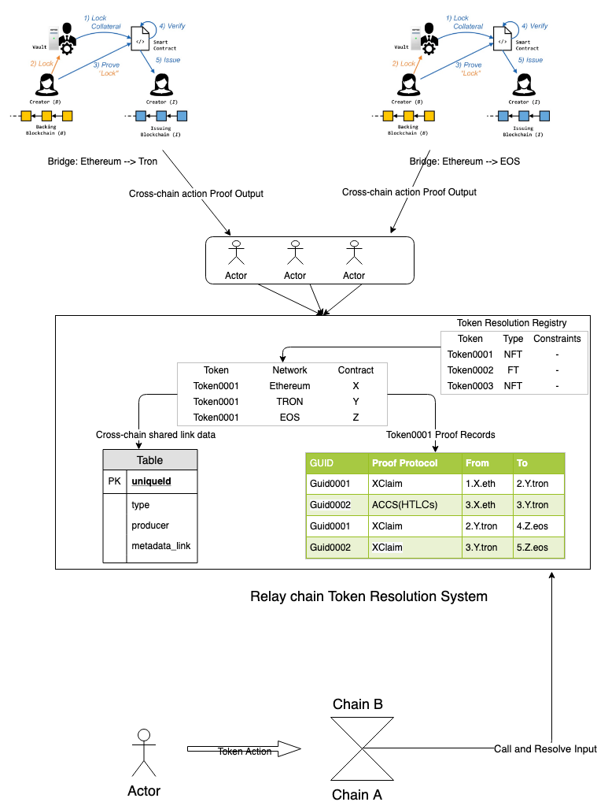

# 跨链通证解析系统(Cross-chain Token Resolution System)


## 概述
本文提出一个跨链通证解析系统，也是一套基于证明的通证解析系统（Proof based token resolution system)，简称PTRS。通过在跨链消息中嵌入解析协议，或通过收集模块对通证跨链证明进行规范转换的方式，为跨链网络提供一套通证解析的服务作为基础设施。

这套通证解析系统旨在通过提供更多事实证明来帮助应用达到可信目的，而非对应用加以约束和限制。换一句话说，应用开发者可以通过采用这个服务来实现其可信应用的目的。

### 假设和观点
- Less Trust, More Truth.
- 跨链消息协议(例如Polkadot的[ICMP](https://wiki.polkadot.network/en/latest/polkadot/learn/interchain/)或者Cosmos的[IBC](https://cosmos.network/docs/spec/ibc/))就像是TCP/IP协议，类似的，通证解析系统像就像是DNS协议。
- 因为不同区块链网络的安全性不一样，所以存在于两个区块链网络的通证，即使被应用当做同一通证对待，但从技术角度，严格意义上讲两个网络的通证也不能视为完全同质。
- Proof即约束，约束即关系账本，可以用于解析。
- 通证解析系统是为中继链设计的通证跨链标准
- 通证解析系统可以和通证跨链转接桥系统一起构建一个更完整的通证跨链解决方案
- Token包括同质Token和非同质Token

## 问题

为了方便的标记一个物品或者一个资产，我们会用一个唯一的标识来标记它，不同的物品具有不同的标识。我们先拿物理空间里面的物品举例，在理想情况下，所有的物品都应该在同一个时空里面，这样大家都能观察的到，并且方便做区分和标识。但是现实情况是，不同的物品可能存在于不同的时空里面，并且观察者也不一定能看到每一个物品。同样的情况，在虚拟资产世界，因为存在不同的账本或称区块链网络(简称域)，不同的物品在同一个域里面因为有不同的标识，可以容易的区分和定位，但是该域里面的观察者无法识别和解析来自外部域的物品标识。

目前现有的很多通证标准的设计，都主要是针对域内资产进行标识设计，没有将不同域内的资产复用考虑进来，这样导致在对非同质资产进行复用时，单独的Token ID无法标识唯一的资产，还需要带上很多域信息，实现起来十分复杂。

跨链技术可以极大的帮助通证在更广泛的区块链网络中实现互联互通，但是同时，也给开发者和用户带来了一些认知和使用门槛，其中就包括通证可识别性的问题。

因为目前的通证标准，例如ERC20或ERC721，只记录的其在某个特定链上的所有权信息，没有考虑到通证有可能会分布在两个区块链网络。当通证同时分布在两个区块链网络时，我们需要一套识别和解析系统帮助用户和通证应用来解析和查询当前的通证状态。当我们给出一个NFT的Token ID时，我们无法确定它目前所在区块链网络是哪个，其所有者是谁，因为当NFT发生跨链转移后，在其中一个区块链网络上该通证处于活跃状态，而其他则处于不可用状态，比如锁定状态。在没有通证解析系统的情况下，链外操作无法确定该NFT在哪条链上时处于活跃状态。

跨链环境下，Token面临的识别性和解析问题，需要新的解决方案和标准来解决。因此我们引入一个基于通证跨链证明的解析系统来解决通证跨链时的定位和解析需求，通过通证解析系统和域内唯一标识，我们可以存在与不同域的通证之间的关联关系映射起来，并标识他们之间的相同与不同。


### 设计思路
最初，为了解决这个问题，我们可能会试图采取类似域唯一标识的思路来解决这些问题，例如试图通过设计各个区块链都支持的全局唯一标识编码标准来解决。但最终我们发现了这个思路的缺陷。

- 需要一个国际行业组织来维护和定义这些编码，否则无法推广
- 不具备很强的可扩展性，无法适应新的跨链协议，限制了跨链协议和跨链应用创新
- 需要兼容现有标准，增加实现难度
- 因为有链相关的信息编码，所以无法保持全局唯一标识保持恒定不变和全局一致。


目前大多数的通证跨链和转接桥方案(例如 XClaim)，都需要通过跨链消息传输证明的方式来实现通证跨链，PTRS通过主动收集这些证明，并规范化处理成解析格式的方式，来为跨链网络提供通证解析查询和证明服务。

主动收集可能是通过来其他通证跨链协议里嵌入解析协议的方式，也有可能是通过加密激励系统来进行激励和收集。



同时，构建这套解析系统还存在一些其他挑战：

- 完整性
有可能因为证明收集并不完全，导致无法提供完整的解析服务。例如

实际发生
```angular2
<A.1>  --> <B.2>  --> <C.3>  --> <D.4>
```

证明收集得到
```angular2
<A.1>  --> <B.2> 

<C.3>  --> <D.4>
```

缺失
```angular2
<B.2>  --> <C.3>
```

类似的完整性问题，可以通过要求跨链转接桥协议嵌入全局唯一标识的方式进行解决，通过全局唯一标识将不同的通证关联起来。例如，收集到的证明可能会变成：
证明收集得到
```angular2
<A.1, guid0001>  --> <B.2, guid0001> 

<C.3, guid0001>  --> <D.4, guid0001>
```

- 可靠性

因为所有的解析数据，都基于证明来生成，并保留相关跨链协议(安全性)和签名的记录。因此解析协议的使用者可以根据其安全需求来使用解析服务，不同的解析数据可以区分对待，而并非必须全部使用。

- 可用性和稳定性

证明收集人的不稳定可能导致解析服务的不稳定，这方面的设计有赖于激励机制的设计。

- 实时有效性

在点对点网络和区块链网络中，通证解析系统只能搜集和记录已经发生的事实证明，但是却不能保证实时有效性，即无法确定解析的状态代表最新的状态。因此在解析查询服务中，解析的结果都会返回解析结果的证明有效性范围和时间有效性范围，通证解析系统无法提供在此范围之外的通证跨链信息，服务使用者需要自己判断如何处理此种情况。

## 技术方案

通证解析协议是存在于中继链上的一种服务和协议，用于记录和解析当前通证在中继链范围内的全局状态，包括跨链历史，各个区块链网路对应的所有权合约地址，其他权利和信息。

### 通证解析结构

```angular2
{
    "协议头": "Darwinia_Token_Resolution_System",
    Tokens: [
        {
            Token_Name: "Land",
            Token_Type: "NFT",
            "跨链信息": {
                "权利": {
                    "所有权" : {
                        title: "<chain_id, ownership_contract>",
                        eth: "<eth, X>",
                        tron: "<tron, Y>",
                        eos: "<eos, Z>",
                        records: [
                            ["guid0001", "1.X.eth", "2.Y.tron"],
                            ["guid0002", "3.X.eth", "3.Y.tron"],
                            ["guid0001", "2.Y.tron", "4.Z.eos"],
                        ]
                    },
                    "使用权": {"..."}
                }
            },
            "Linked_Data" : "<信息(类型，生产商)>"
        }
    ]
}
```


#### 协议头

#### 跨链解析信息
WIP

#### 其他跨链共享数据

目前通证标准主要的设计是针对所有权信息进行记录，但是并没有对通证的跨链转账，使用权，类型，生产商等信息进行记录，使得通证合约对通证的描述并不全面，也没有提供可扩展的方法来增加其他的信息。

设计通证解析系统的一个额外好处是，因为可以把中继链看做一个共享的模块(共享存储和共享运行时SPREE)。我们引入Token解析合约(脚本)来记录和更新Token的协议、跨链、权利和其他信息。

对于Polkadot架构，可以通过接入SPREE模块，在解析合约内定义约束条件，例如全局的通证总量，发行规则，并部署至SPREE模块，可以实现中继网络管辖范围的验证和可信互操作。

### 通证解析查询消息规范
[WIP]

更多关于SPREE模块的介绍，参考 https://wiki.polkadot.network/en/latest/polkadot/learn/spree
[WIP]

### 通证跨链消息收集

当我们讨论跨链时，一般需要分成两种情况：

#### Cross parachain(同构区块链/平行链)

当在平行链之间进行跨链时，例如在Polkadot网络中，因为有共享安全，ICMP等设计，因此将通证解析系统放在中继链上时最合适的，因为通证跨平行链的消息会流经中继链，中继链可以通过在消息中继模块之外，嵌入一个收集模块，将通证跨链消息规范化统一收集之后，提供给通证解析服务。

#### Cross major chain (异构链，e.g Ethereum <--> Bitocin, Ethereum <-->TRON, Ethereum <--> Polkadot)

在这种跨链模式下，通证跨链一般通过跨链转接桥的方案进行跨链，例如ACCS(HTLCs), XClaim, Parity Bridge(Mainet/Sidechain)。跨链消息及相关证明并未流经通证解析服务所在的中继链，而是通过设计收集人激励机制，通过收集人主动收集这些通证跨链证明。从这个角度上将，通证解析服务的链设计成中继链没有优势。

但是通证解析系统设计在中继链的一个[可能的好处](https://github.com/darwinia-network/rfcs/issues/15)是，可以在跨链消息收集协议规范化之后，外部的通证跨链转接桥协议可以通过嵌入通证解析系统收集协议的方式，支持通证解析系统，以达到更好的可靠性和完整性和解析性。

##### 异构链跨链转接桥解决方案XClaim的集成
对于基于XClaim技术搭建的跨链转接桥，其Token的跨链是通过在对手链上构建超额抵押的对称CBA来实现的。虽然严格意义上讲，CBA不等同于原通证，但是从用户视角看其效果非常接近。

[WIP]对于这类异构链之间跨链通证的支持仍有希望通过通证解析系统来描述和解析其跨链转接桥过程，只需跟中继链和平行链模式的跨链通证类型稍作区分，便可帮助开发者和用户理解其跨链通证(CBA)和原有通证的区别。

因为需要喂价机制，XClaim解决方案比较适合流动性好的同质Token，但对于价格发现低效的NFT来说，就[不那么友好](https://github.com/darwinia-network/rfcs/issues/16)了。

NFT的跨链转接桥方案目前缺乏相关的研究，比较务实的方案可能是由Token创建者指定信任账号作为跨链证明提交者，并结合质押以降低风险。这个方案带来一定程度中心化，但目前也没有更好的办法。

### 基础设施支持
类似钱包和区块链浏览器这样的基础设施将可以很好的支持跨链通证，通过接入通证解析系统，可以很方便的定位和浏览该通证的全局信息，并进行相关操作。
[WIP]

### 标准接口
WIP

### 推荐实现
WIP

### 全局唯一标识

To harmonise existing practice in identifier assignment and resolution, to support resources in implementing community standards and to promote the creation of identifier services.

通证解析系统分配的TOKEN ID将可以作为该Token在跨链网络中的全局Token标识(Base Token ID)。

对于同质Token来说，因为没有通证的索引，只有数量的概念，解析通证ID可以作为全局通证ID。

对于非同质Token来说，将可以使用解析通证ID加上一个Token内索引得到的编码[解析通证ID+Token_Index]作为全局唯一标识。


### 链上数据和链下数据

Token相关的数据分为链上和链下两种，其作用和价值不一样，链上数据可以很方便的用于智能合约和交易处理，而链下数据更多的用于描述，表达和引用资源文件。
Onchain Linked Data
[WIP]

#### Offchain Metadata and ontology tooling
[WIP]

#### Token Schema
To encourage the use of schema.org markup within token web resources to improve discoverability of information. [WIP]

### 适配器

对于那些使用已有区块链网路的通证标准实现的通证，可以通过在区块链网路内部实现一个适配器合约，以接入这套识别和解析系统，这个适配器可能是通证跨链转接桥的一个部分。

对于支持跨链消息协议的区块链网路，将可以实现通证跨链消息通信。

对于支持SPREE协议或跨链转接桥的区块链网路，将可以实现通证跨链可信转账和互操作。

下面是一些常见通证标准的适配器参考实现：
#### 以太坊ERC20适配器
[WIP]
#### 以太坊ERC721适配器
[WIP]
#### 以太坊ERC1155适配器
[WIP]
#### EOS dGoods适配器
[WIP]
#### Cocos BCX NHAS-1808适配器
[WIP]


### SDK和工具集

#### Token Service Framework

To identify valuable interoperability services within Polkadot and support their improvement. 

To identify existing services outside Polkadot and develop of strategic partnerships with them.

To identify the interoperability services that need to be developed.
Workflow and Tool interoperability

#### Interoperability Knowledge Hub

#### Implementation Studies


## 参考

https://eprint.iacr.org/2018/643.pdf

https://elixir-europe.org/platforms/interoperability

https://github.com/AlphaWallet/TokenScript

https://github.com/darwinia-network/rfcs/blob/v0.1.0/zh_CN/0005-interstella-asset-encoding.md

https://onlinelibrary.wiley.com/doi/pdf/10.1087/20120404

https://wiki.polkadot.network/en/latest/polkadot/learn/spree/

https://en.wikipedia.org/wiki/Unique_identifier

https://en.wikipedia.org/wiki/Identifiers.org

https://schema.org/

https://medium.com/drep-family/cross-chains-a-bridge-connecting-reputation-value-in-silo-b65729cb9cd9

https://github.com/paritytech/parity-bridge
