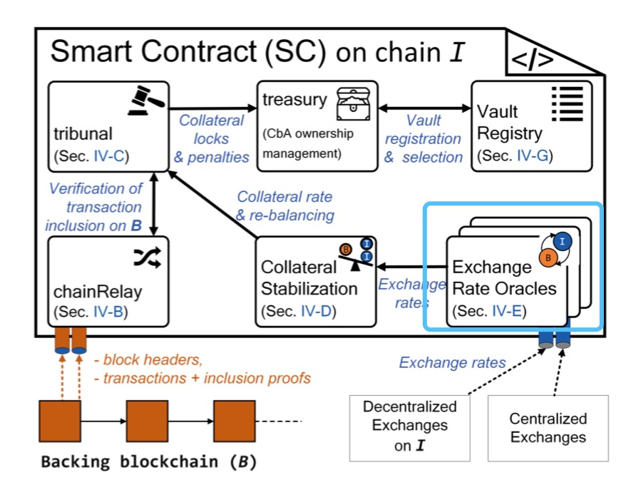

# 基于XClaim的NFT跨链协议(XClaim Based NFT Bridge Protocol)

## 概述
本文基于XClaim的通证跨链方案，提出改进并应用于NFT的跨链场景，通过引入哈伯格税收机制代替交易所喂价机制，来实现价格发行功能，设计了一套符合NFT跨链的协议。

### 问题描述
[XClaim](https://eprint.iacr.org/2018/643.pdf)提供了一种对于流动性良好的同质化通证友好安全的跨链解决方案。但是对于Non-fungible token, 定价困难和流动性匮乏导致了XClaim在NFT跨链流转时，有较大的局限性。

在安全方面，部分关键点如下：
**Pricing**:  需要一个oracle来获取chain I 上的native token  *i* 对chain B上的native token  *b* 的价格关系；
**Over-collateralize**: 在抵押的总价值和真实价值之间需要有一定的容错空间,  *buffer* , 来保证价格波动时的安全。参考DAI.

以上两点均有一个前提，即 *i* 和 *b* 均需要有良好的流动性来保证定价。这对于fungible token相对更容易实现。

更多的细节，可以参考XClaim Sec. IV-D: Mitigating Exchange Rage Functions (Redeemability).

相关问题 [RFCs Issues #16](https://github.com/darwinia-network/rfcs/issues/16), [RFCs Issues #17](https://github.com/darwinia-network/rfcs/issues/17)

### Oracle在NFT定价上的缺陷
因为定价是抵押的基础，所以解决了定价的问题，某种程度上，也就解决了足额/超额抵押的问题，从而保证了跨链的安全性。
在XClaim方案中，主要通过Oracle实现了喂价。但是Oracle在NFT定价中，有以下缺点：
1. NFT market市场规模小，流动性差；
2. NFT交易所太少，主观偏差大；
3. 每次跨链之前，均需要创建拍卖提供价格，用户操作成本高；

因此，在对待NFT的跨链上，需要有不一样的价格发现机制。

## 解决方案

我们通过引入哈伯格税收机制，来解决价格发现问题。牵涉的关键模块包括iSC的Collateral Stabilization 和 Exchange Rate Oracles。

### 哈伯格税收(Harberger Tax)
哈伯格税收模式，其为财产所有权如何运作引入了两个概念：

公民评估自己的财产，并基于该价格进行纳税——自我评估税； 任何人在任何时候，都可以以该价格从你那里购买财产，也就是说，任何人在任何时候都可以迫使你对财产进行出售。

### NFT价格评估模块
在XClaim的方案中，算法如下：

图中用线框框住的部分，属于受到影响和需要修改的部分，主要为*i_col*，包括Protocol Issue 和 Redeem.

假设目前全网已经存在了一些 *vaults* 并且抵押了一些 *i* ，当Requester想chain B 上的NFT  *nft_b* 跨到chain I上时，需要:

- (i) Vault在chain I 确认当前是否有足够collateral i (| *i* | = | *price_b* |)，主要是用于Redeem时作为ProofOrPunish的抵押金；

- (ii) Requester对 *nft_b* 评估并申明一个价格 *price_b*，并提交跨链转账commit及相应抵押*i_commit_col*，支付一笔跨链金额，fee_ratio * *price_b* 用于支付跨链手续费，同时Lock *nft_b*;

- (iv) Requester提交Lock成功Tx到Issuing Chain iSC的chainRelay来Verify，Verify成功后会Issue并返还*i_commit_col*并扣除手续费fee_ratio * *price_b*，Verify失败则扣除*i_commit_col*并返还手续费。

Redeem最后的环节，Vault需要提交release的证明到Issuing Chain iSC的chainRelay来Verify，如果Verify失败那么相应的 *vault* 会被扣除 *price_b* 等值的 *i* ，用于弥补用户的损失；如果跨链成功，这笔手续费就会被支付给相应的 *vault* .

#### 优点
1. 定价无需依赖oracle，在市场规模和流动性不足时，也可以定价成功；
2. 用户无需去外部的NFT交易所再单独实行定价操作；
3. 定价和成本之间存在线性关系，会给到 *vault* 足够的incentive

### [Redeemability和所有权变化后的价格持续评估](https://github.com/darwinia-network/rfcs/issues/17#issuecomment-530442741)

可赎回性，是指当NFT从Issuing chain赎回到Backing Chain时，如果Vault无法释放NFT，或者提交的NFT释放证明验证失败，需要有足额的抵押来补偿NFT所有者。

如果NFT在跨链后发生了转账，例如以更高价格卖给了其他人，新的NFT所有者可能有更高的评估价格，导致Vault在iSC中没有足额的抵押来保证可赎回性。这时我们需要设计一套持续评估的机制，来保证新的NFT所有者持有NFT的安全性。

NFT所有者可以随时发起一个新的申明交易，评估其NFT的最新价格(有点类似喂价的价格变化)，指定一个Backing chain账户*acccount_b*并交纳一定的手续费(按照百分比收取)，Vault需要相应补足抵押物。此时Vault的抵押率可能存在三种状态。

- 充足抵押

抵押率高于理想值，不需要做任何事情

- 缓冲抵押

抵押率低于理想值，但是高于安全值，Vault需要补足抵押物，以满足要求。

- 流动性边际

抵押率低于安全值, 如果Vault不立马补足抵押物，iSC会自动的启动赎回流程，将该NFT赎回至其所有者申明时指定的Backing chain账户*acccount_b*。

这种情况类似于XClaim中，当通证流动性不好，或者抵押物资产突然发生突然下降时，所发生的情况。

## NFT解析模块

为了方便的标记一个物品或者一个资产，我们会用一个唯一的标识来标记它，不同的物品具有不同的标识。我们先拿物理空间里面的物品举例，在理想情况下，所有的物品都应该在同一个时空里面，这样大家都能观察的到，并且方便做区分和标识。但是现实情况是，不同的物品可能存在于不同的时空里面，并且观察者也不一定能看到每一个物品。同样的情况，在虚拟资产世界，因为存在不同的账本或称区块链网络(简称域)，不同的物品在同一个域里面因为有不同的标识，可以容易的区分和定位，但是该域里面的观察者无法识别和解析来自外部域的物品标识。

目前现有的很多通证标准的设计，都主要是针对域内资产进行标识设计，没有将不同域内的资产复用考虑进来，这样导致在对非同质资产进行复用时，单独的Token ID无法标识唯一的资产，还需要带上很多域信息，实现起来十分复杂。

跨链技术可以极大的帮助通证在更广泛的区块链网络中实现互联互通，但是同时，也给开发者和用户带来了一些认知和使用门槛，其中就包括通证可识别性的问题。

因为目前的通证标准，例如ERC20或ERC721，只记录的其在某个特定链上的所有权信息，没有考虑到通证有可能会分布在两个区块链网络。当通证同时分布在两个区块链网络时，我们需要一套识别和解析系统帮助用户和通证应用来解析和查询当前的通证状态。当我们给出一个NFT的Token ID时，我们无法确定它目前所在区块链网络是哪个，其所有者是谁，因为当NFT发生跨链转移后，在其中一个区块链网络上该通证处于活跃状态，而其他则处于不可用状态，比如锁定状态。在没有通证解析系统的情况下，链外操作无法确定该NFT在哪条链上时处于活跃状态。

跨链环境下，Token面临的识别性和解析问题，需要新的解决方案和标准来解决。因此我们引入一个基于通证跨链证明的解析系统来解决通证跨链时的定位和解析需求，通过通证解析系统和域内唯一标识，我们可以存在与不同域的通证之间的关联关系映射起来，并标识他们之间的相同与不同。

### 设计思路
XClaim需要通过跨链消息传输证明的方式来实现通证跨链，通证解析模块是XClaim_NFT协议内嵌的一个模块，用于在Issuing chain或者其连接的中继链上记录和解析当前通证在中继链范围内的全局状态，并规范化处理成解析格式的方式，来为跨链网络提供通证解析查询和证明服务。

#### 其他跨链共享数据

目前通证标准主要的设计是针对所有权信息进行记录，但是并没有对通证的跨链转账，使用权，类型，生产商等信息进行记录，使得通证合约对通证的描述并不全面，也没有提供可扩展的方法来增加其他的信息。

设计通证解析系统的一个额外好处是，因为可以把中继链看做一个共享的模块(共享存储和共享运行时SPREE)。我们引入Token解析合约(脚本)来记录和更新Token的协议、跨链、权利和其他信息。

对于Polkadot架构，可以通过接入SPREE模块，在解析合约内定义约束条件，例如全局的通证总量，发行规则，并部署至SPREE模块，可以实现中继网络管辖范围的验证和可信互操作。

### 通证解析查询消息规范
[WIP]

更多关于SPREE模块的介绍，参考 https://wiki.polkadot.network/en/latest/polkadot/learn/spree
[WIP]

### 通证跨链消息收集

当我们讨论跨链时，一般需要分成两种情况：

#### Cross parachain(同构区块链/平行链)

当在平行链之间进行跨链时，例如在Polkadot网络中，因为有共享安全，ICMP等设计，因此将通证解析系统放在中继链上时最合适的，因为通证跨平行链的消息会流经中继链，中继链可以通过在消息中继模块之外，嵌入一个收集模块，将通证跨链消息规范化统一收集之后，提供给通证解析服务。

#### Cross major chain (异构链，e.g Ethereum <--> Bitocin, Ethereum <-->TRON, Ethereum <--> Polkadot)

在这种跨链模式下，通证跨链一般通过跨链转接桥的方案进行跨链，例如ACCS(HTLCs), XClaim, Parity Bridge(Mainet/Sidechain)。跨链消息及相关证明并未流经通证解析服务所在的中继链，而是通过设计收集人激励机制，通过收集人主动收集这些通证跨链证明。从这个角度上将，通证解析服务的链设计成中继链没有优势。

但是通证解析系统设计在中继链的一个[可能的好处](https://github.com/darwinia-network/rfcs/issues/15)是，可以在跨链消息收集协议规范化之后，外部的通证跨链转接桥协议可以通过嵌入通证解析系统收集协议的方式，支持通证解析系统，以达到更好的可靠性和完整性和解析性。

##### 异构链跨链转接桥解决方案XClaim的集成
对于基于XClaim技术搭建的跨链转接桥，其Token的跨链是通过在对手链上构建超额抵押的对称CBA来实现的。虽然严格意义上讲，CBA不等同于原通证，但是从用户视角看其效果非常接近。

[WIP]对于这类异构链之间跨链通证的支持仍有希望通过通证解析系统来描述和解析其跨链转接桥过程，只需跟中继链和平行链模式的跨链通证类型稍作区分，便可帮助开发者和用户理解其跨链通证(CBA)和原有通证的区别。

因为需要喂价机制，XClaim解决方案比较适合流动性好的同质Token，但对于价格发现低效的NFT来说，就[不那么友好](https://github.com/darwinia-network/rfcs/issues/16)了。

NFT的跨链转接桥方案目前缺乏相关的研究，比较务实的方案可能是由Token创建者指定信任账号作为跨链证明提交者，并结合质押以降低风险。这个方案带来一定程度中心化，但目前也没有更好的办法。

### 全局唯一标识

To harmonise existing practice in identifier assignment and resolution, to support resources in implementing community standards and to promote the creation of identifier services.

通证解析系统分配的TOKEN ID将可以作为该Token在跨链网络中的全局Token标识(Base Token ID)。

对于同质Token来说，因为没有通证的索引，只有数量的概念，解析通证ID可以作为全局通证ID。

对于非同质Token来说，将可以使用解析通证ID加上一个Token内索引得到的编码[解析通证ID+Token_Index]作为全局唯一标识。

## 假设和观点
- Less Trust, More Truth
- 因为不同区块链网络的安全性不一样，所以存在于两个区块链网络的通证，即使被应用当做同一通证对待，但从技术角度，严格意义上讲两个网络的通证也不能视为完全同质。
- 通证解析系统可以和通证跨链转接桥系统一起构建一个更完整的通证跨链解决方案
- Harberger tax is more than taxation, it can be used as a way of price-finding.

## 参考

https://eprint.iacr.org/2018/643.pdf

https://elixir-europe.org/platforms/interoperability

https://github.com/AlphaWallet/TokenScript

https://github.com/darwinia-network/rfcs/blob/v0.1.0/zh_CN/0005-interstella-asset-encoding.md

https://onlinelibrary.wiley.com/doi/pdf/10.1087/20120404

https://wiki.polkadot.network/en/latest/polkadot/learn/spree/

https://en.wikipedia.org/wiki/Unique_identifier

https://en.wikipedia.org/wiki/Identifiers.org

https://schema.org/

https://medium.com/drep-family/cross-chains-a-bridge-connecting-reputation-value-in-silo-b65729cb9cd9

https://github.com/paritytech/parity-bridge

https://vitalik.ca/general/2018/04/20/radical_markets.html

https://talk.darwinia.network/topics/99

